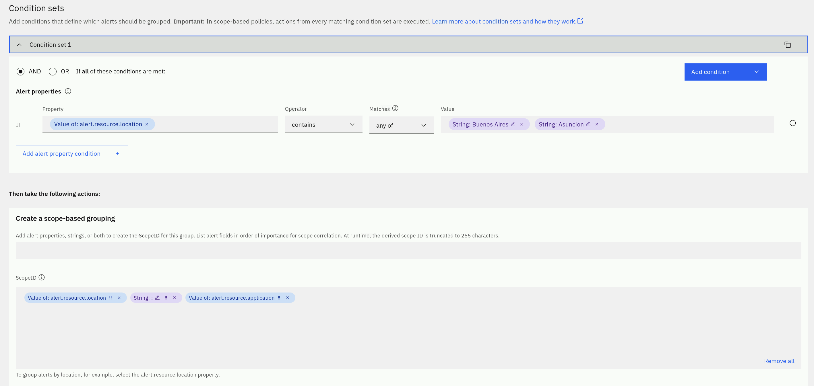
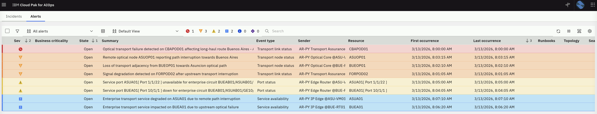
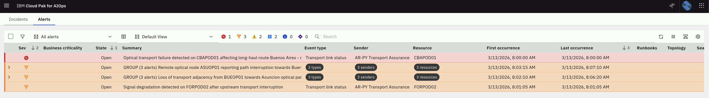
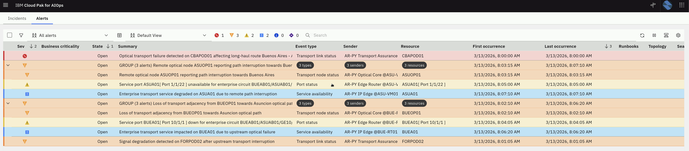

Scope-based grouping is very powerful and provides significant event reduction
by virtue of grouping alerts, thereby effectively reducing the "noise" presented
to operations personnel.

Scope-based alert grouping is based on a basic premise that alerts occurring at
"around the same place", and "about the same time" are likely related.

For example, a failure in an optical transport link between Buenos Aires and Asunción can impact multiple network layers. This may generate alerts from optical transport nodes, core routers, and access edge devices within a short time window. Although these alerts originate from different technologies, they are all related to the same underlying service disruption.

The objective here is to be able to group alerts based on common properties and
time of occurrence to identify when issues might be related. When related alerts
are grouped based on their scope, you can view the details in the Alert Viewer.

The default scope-based policy in Cloud Pak for AIOps is a correlation on
alert.resource.name constrained by a rolling window of 15 minutes. This will
become more clear in the next steps.

## 5.1: Create a Scope-based Event Grouping Policy

Scope-based grouping enable operations teams to provide local knowledge on how
alerts should be grouped by defining scope-based grouping policies.

We will play the role of a Network Operations Engineer responsible for a 
telecommunications service deployed across multiple regions, such as Buenos Aires 
and Asunción. We have observability tools monitoring different layers of the network, 
including core routers, transport (optical) network, and service endpoints. 
The challenge is that alerts related to each network layer are not correlated despite 
belonging to the same end-to-end service.

To facilitate your Network Operations Engineer work, you will create a new scope-based 
policy that will
group alerts that have the common resource value alert.resource.application and that belong 
to the two network locations Buenos Aires and Asunción. Also, we want the
alert grouping to happen within a 15 minute rolling window. In other words,
alerts separated by more than 15 minutes will not be grouped together.

We will first review the default scope-based policies that come with the
product. Log into the Cloud Pak for AIOps:

- From the burger menu in the top-left navigate to: **Operate → Automations**
- From the **Automations** page, we will explore the existing scope-based
  policies that come out-of-the-box

  - Click on **Filter** icon on the left, check **scope-based** and click
    **Apply**

- 
  - Note that there are two scope-based policies already defined
  - Select on the **Policy name** of the first policy
- 
  - On the right-side slider, click on the **Specification** tab and explore the
    **Policy action** rule logic
- 
  - Now click on the down-arrow and explore the **Policy action** rule logic of
    the second scope-based policy
  - Click on the X to close the slider

Now we will create a new scope-based policy:

- From the same **Automations** page, select the **Policies** tab and click the
  **Create policy** button
- From the **Policy templates** page, select the **Group alerts based on scope**
  tile
- From the **Group alerts based on scope** page:

  - Make sure the **Policy** is **Enabled** (green)
  - Under **Policy details**, set the **Policy name** as "Group Telco Alerts by Location and Service"
  - Change the **Execution order** slider value to **40**
  - Under Policy triggers, check **Before an alert is created**
  - Under **Condition sets**:
    - click on **Add condition** and select **Alert property**
    - 
    - Leave **AND** selected
    - For **Property** select **alert.resource.location**
    - For **Operator** select **contains**
    - For **Matches** select **any of**
    - For **Value** type (use uppercase in both) Buenos Aires and select
      `String: Buenos Aires`, type Asuncion and select `String: Asuncion`
  - Under **Create a scope-based grouping**:

    - select **resource.location**
    - type the colon character **:** and select **String: :**
    - select **resource.application**
    - Your final value for ScopeID should be
      - **Value of: alert.resource.location String: : Value of:
        alert.resource.application**
      - as shown below
      - 

  - Under **Time window**:
    - For time period field type 900. This represents 900 seconds (15 min)
    - Under **Type**, select **Rolling**. This means that alerts will be grouped
      as long as they are not separated by more than 15 min

Your new policy should look like the charts below:

  

- Finally, click on **Create Policy** on the top-right.

Now you should have 3 scope-based policies. We will first submit events with all
scope policies disabled and later we will resubmit the same events with the new
policy enabled. Make sure to **disable all three policies** as shown below. You
may be asked to confirm the action (the values in the **Status** column may be
different).


## 5.2: Submit Events with the scope-based Policy Disabled

Create a new file called _scope_events.json_ by running the following command in
the **Terminal** window to open the text editor, **copy** the event data below,
**paste** it into the text editor, click on the **Save** button in the text
editor and **close** the editor window (click on the X).

```
gedit scope_events.json
```

```
{"sender":{"service":"IBM Netcool Transport Monitoring","name":"AR-PY Optical Core @BUE-RT01","type":"Netcool"},"resource":{"application":"Telco Transport AR-PY","name":"BUEOP01","hostname":"bueop01.telco-demo-ar-py.local","type":"device","ipaddress":"10.20.10.11","location":"Buenos Aires"},"type":{"classification":"Transport node status","eventType":"problem"},"severity":5,"summary":"Loss of transport adjacency from BUEOP01 towards Asuncion optical path","occurrenceTime":"2026-03-13T12:02:10.000Z","expirySeconds":0}
{"sender":{"service":"IBM Netcool Transport Monitoring","name":"AR-PY Optical Core @ASU-VM01","type":"Netcool"},"resource":{"application":"Telco Transport AR-PY","name":"ASUOP01","hostname":"asuop01.telco-demo-ar-py.local","type":"device","ipaddress":"10.20.10.12","location":"Asuncion"},"type":{"classification":"Transport node status","eventType":"problem"},"severity":5,"summary":"Remote optical node ASUOP01 reporting path interruption towards Buenos Aires","occurrenceTime":"2026-03-13T12:03:15.000Z","expirySeconds":0}
{"sender":{"service":"IBM Netcool Access Edge Monitoring","name":"AR-PY Edge Router @BUE-RT01","type":"Netcool"},"resource":{"application":"Telco Transport AR-PY","name":"BUEA01[ Port 10/1/1 ]","hostname":"buea01.telco-demo-ar-py.local","type":"port","ipaddress":"10.20.20.21","location":"Buenos Aires"},"type":{"classification":"Port status","eventType":"problem"},"severity":4,"summary":"Service port BUEA01[ Port 10/1/1 ] down for enterprise circuit BUEAB01/ASUAB01/GE10/1/4","occurrenceTime":"2026-03-13T12:04:05.000Z","expirySeconds":0}
{"sender":{"service":"IBM Netcool Access Edge Monitoring","name":"AR-PY Edge Router @ASU-VM01","type":"Netcool"},"resource":{"application":"Telco Transport AR-PY","name":"ASUA01[ Port 1/1/22 ]","hostname":"asua01.telco-demo-ar-py.local","type":"port","ipaddress":"10.20.20.22","location":"Asuncion"},"type":{"classification":"Port status","eventType":"problem"},"severity":4,"summary":"Service port ASUA01[ Port 1/1/22 ] unavailable for enterprise circuit BUEAB01/ASUAB01/GE10/1/4","occurrenceTime":"2026-03-13T12:05:00.000Z","expirySeconds":0}
{"sender":{"service":"IBM Netcool Edge Device Monitoring","name":"AR-PY IP Edge @BUE-RT01","type":"Netcool"},"resource":{"application":"Telco Transport AR-PY","name":"BUEA01","hostname":"buea01.telco-demo-ar-py.local","type":"device","ipaddress":"10.20.10.21","location":"Buenos Aires"},"type":{"classification":"Service availability","eventType":"problem"},"severity":3,"summary":"Enterprise transport service impacted on BUEA01 due to upstream optical failure","occurrenceTime":"2026-03-13T12:06:20.000Z","expirySeconds":0}
{"sender":{"service":"IBM Netcool Edge Device Monitoring","name":"AR-PY IP Edge @ASU-VM01","type":"Netcool"},"resource":{"application":"Telco Transport AR-PY","name":"ASUA01","hostname":"asua01.telco-demo-ar-py.local","type":"device","ipaddress":"10.20.10.22","location":"Asuncion"},"type":{"classification":"Service availability","eventType":"problem"},"severity":3,"summary":"Enterprise transport service degraded on ASUA01 due to remote path interruption","occurrenceTime":"2026-03-13T12:07:10.000Z","expirySeconds":0}
{"sender":{"service":"IBM Netcool Transport Monitoring","name":"AR-PY Transport Assurance @CBA-NC01","type":"Netcool"},"resource":{"application":"Telco Transport AR-PY","name":"CBAPOD01","hostname":"cbapod01.telco-demo-ar-py.local","type":"fiberConnection","ipaddress":"10.20.30.41","location":"Cordoba"},"type":{"classification":"Transport link status","eventType":"problem"},"severity":6,"summary":"Optical transport failure detected on CBAPOD01 affecting long-haul route Buenos Aires - Asuncion","occurrenceTime":"2026-03-13T12:00:00.000Z","expirySeconds":0}
{"sender":{"service":"IBM Netcool Transport Monitoring","name":"AR-PY Transport Assurance @FOR-CT01","type":"Netcool"},"resource":{"application":"Telco Transport AR-PY","name":"FORPOD02","hostname":"forpod02.telco-demo-ar-py.local","type":"fiberConnection","ipaddress":"10.20.30.42","location":"Formosa"},"type":{"classification":"Transport link status","eventType":"problem"},"severity":5,"summary":"Signal degradation detected on FORPOD02 after upstream transport interruption","occurrenceTime":"2026-03-13T12:01:05.000Z","expirySeconds":0}
```

Now lets submit the events via the webhook script created in the previous
section by running the following command in the **Terminal** window:

```
bash event-load-webhook.sh scope_events.json
```

- From the burger menu in the top-left navigate to: **Operate → Alerts**
- Click on the **Refresh alerts** icon on the right, to see the alerts we just
  loaded.
- Lets add some color to this page:
  - Click on the **gear** icon in the right and select **User preferences**.
  - From the **User preferences for alerts** pop-up, click on the **Row
    coloring** slider to On (green).
  - Click on **Save**.

Note that all the Alerts are reflected in this Alerts view (now with color) but
there is no grouping done as shown below:



Before resubmitting events again, we will clear all these Alerts in the view:

- Select all the Alerts, right-click and select **Clear**.
- The Alerts will change state from **Open** to **Clear** and eventually to
  **Closed**.
- Wait 2-3 minutes until the Alert view is empty. Click the **Refresh** icon to
  see changes.

## 5.3: Submit Events with the scope-based Policy Enabled

We will now confirm that the scope-based correlation policy is actually working
as expected, by enabling the policy and resubmitting the events.

- From the burger menu in the top-left navigate to: **Operate → Automations**
- From the **Automations** page, click on **Filter** icon on the left, check
  **scope-based** and click **Apply** (this may be already done).
- Enable the scope-based policy "Group Alerts coming from 2 Locations by
  Location-Application" that you created in the previous step.

You should see one policy enabled, as shown below:


Now lets submit the events again via the webhook script created in the previous
section by running the following command from the **Terminal** window

```
bash event-load-webhook.sh scope_events.json
```

Lets see the Alerts view again:

- From the burger menu in the top-left navigate to: **Operate → Alerts**

Note that now, the Alerts are grouped by Location and Service. Note also
that Alerts from locations outside Buenos Aires and Asuncion are not grouped.



Expand the groups by clicking on the "twisty" icon on the left for each group,
as shown below




## 5.4 Cleanup

Finally, we will clear all these Alerts in the view before we move to the next
section

- Select each group of Alerts, right-click and select **Clear**. Do the same
  with the ungrouped Alerts.
- The Alerts will change state from **Open** to **Clear** and eventually to
  **Closed**.
- Wait 2-3 minutes until the Alert view is empty. Click the **Refresh** icon to
  see changes.

Also, lets disable the scope policy so it does not interfere with the rest of
the Lab:

- From the burger menu in the top-left navigate to: **Operate → Automations**
- From the **Automations** page, if there is no **Scope-based** filter set
  already, click on Filter icon on the left, check **Scope-based** and click
  **Apply**.
- Click on the slider on the policy that is **Enabled** in green to change it to
  **Disabled** in grey as shown below


## 5.5: Recap

We created a new **scope-based correlation policy** that groups alerts within a
15 minute rolling window by alert.resource.location and
alert.resource.application and where the location is one of two cloud regions
Buenos Aires and Asuncion.
