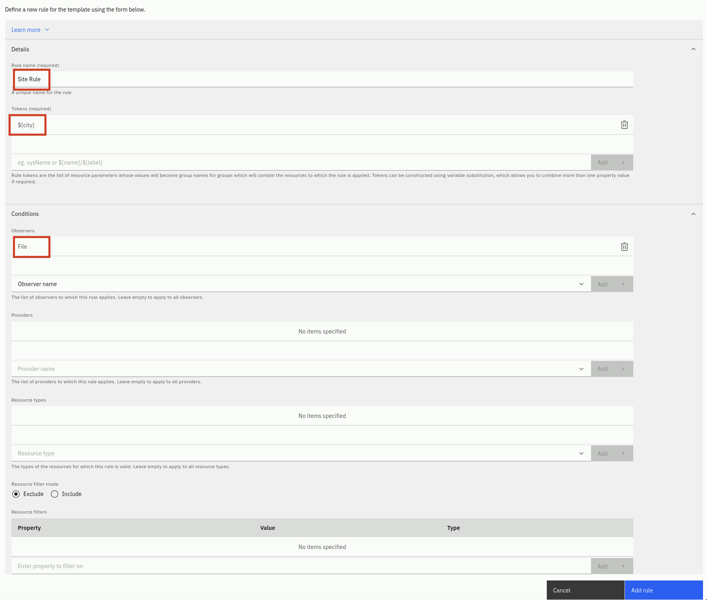
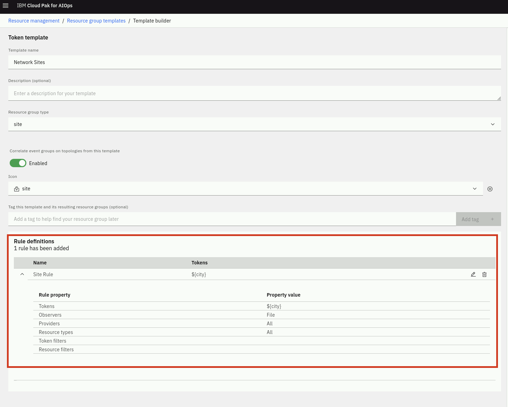
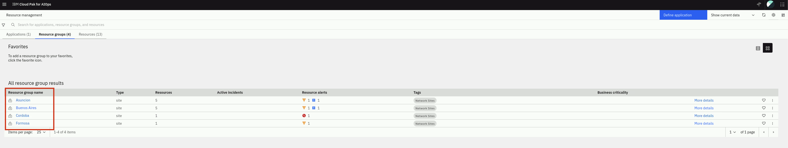

This chapter focuses on topology group templates, the different types, and how
groups of topology can be used for topology-based event correlation. We will use
the topology we created in the previous chapters.

By the end of this chapter, you will understand the four types of topology
templates, and have created an example of each type. You will also understand
what a "favorite" is and will have added some items to your topology dashboard.

Topology group templates are used to create groups of resources. Resource groups
make it easier to find and visualize collections of related resources, as well
as enabling event correlation over resources in the same group. There are four
types of topology group template:

- **Exact**: defines a single group of specific resources
- **Tag-based**: defines a single group of resources that share a common tags
- **Dynamic**: defines one or more groups of resources that match a prescribed
  specification
- **Token**: defines a set of rules which use the properties of your resources
  to create one or more groups which contain those resources

Note that **Exact** and **Tag-based** templates creates a **single** resource
group while **Dynamic** and **Token** templates could create **multiple**
resource groups.

## 5.1: Exact Group Template

An exact template builds a single group of resources centered on a specified
seed resource. The membership of the resulting resource group includes the seed
resource and those matching the specified relationship and/or resource type
criteria. Resource group membership is dynamically maintained for the resulting
resource group provided the specified seed resource type remains unchanged.

For example, you can use an exact template to create a group of resources only
for a specific Jenkins build pipeline and any new builds or physical server and
its connected network switch.

The exact topology group template is useful for when you have a specific
collection of resources that are unique in your environment that may be of
particular importance. Perhaps you want to be able to find this group of
resources quickly and easily.

## 5.2: Tag Group Template

A tag based template builds a single but dynamic resource group containing
resources that have the specified tag(s). Resource group membership is
dynamically maintained to reflect changes in the topology for resources that
gain or lose the specified tags.

For example, you can use a tag based template to create a dynamic group of your
resources tagged with both 'red' and 'green'. Then, when you add new resources
with both of those tags, the resource group will be updated to include them.

Note that resources don't have to be connected; they simply need to have the
common tag in order to be grouped. Tags can be added to resources via the
topology **tagsRule** as discussed in the previous chapter, or by including the
tags parameter if creating topology via the File or REST Observers.

## 5.3: Dynamic Group Template

A dynamic group template builds multiple groups of resources that are similar to
the specified seed resource and relationship and/or resource type criteria.
Resource group creation and membership is dynamically maintained based on the
available topology data and how it changes.

For example, you can use a dynamic group template to create dynamic groups of
resources, one for each of your virtual machines and the Kubernetes services
they're running. Resource groups are then added, removed and updated as you add
or remove virtual machines and/or services running on them.

The Dynamic group template is probably the most versatile of all the topology
group templates. Using an example of a set of resources you want to group, the
dynamic group template will automatically find other groups of resources that
follow the same _recipe_ as the example you give. As you expose the resources
and relationships in the view, the template builder records the steps, and then
uses this _recipe_ to find other similar groups of resources.

## 5.4: Token Group Template

A token template builds multiple groups of resources using one or more rules.
Any resource that matches one of the rules will be added to a group whose name
is based on the rule's token. Resource group membership is dynamically
maintained to reflect changes in the topology for resources that match one of
the template's rules.

For example, you could create a token template containing a rule with a token of
'deviceID'. When you next load data, if you have three resources which each
have an deviceID property value of 'MyDevice', then a group called 'MyDevice'
will be created, and those three resources will be added to it.

As token group templates apply rules only to resources that are received via
observer jobs, the only way to actually see the new resource groups created by
this template is by running the related observer jobs.

#### Exercise

We will create a Token group template to group devices based on the
location.

In the **Resource management** page, click on the **Resource group templates**
icon in the top-right. In the **Resource group templates** page, click on
**Create a new template**, select **Token template** and click **Start**.

You will be presented with a **Template builder** page. From here, use the
following steps to configure a token template:

- Give the template a **name** e.g. token template
- Choose the **Resource group type: site**
- Enable **Correlate event groups on topologies from this template** to
  correlate events across these resources
- On the right side, set the Rule name as **Site Rule**
- For **Tokens** type `${city}` and click on **Add**.
- Expand the **Conditions** section
  - For **Observers** select **File** and click on **Add**
  - Skip **Providers** as this will apply to all File Observer providers
  - Skip **Resource types** as we want it to apply to every resource.
  - Skip the **Token filter mode** as we don't need additional logic to filter.

Your rule should look like this:

- Click on **Add rule**.

- Now confirm that you see the new rule under **Rule definitions** as shown
  below

- Finally click on **Save template**.

As this template will create new groups based on the location and these
resources are in the **topology** resource data file, please rerun the
**topology** observer job to actually apply the rules in this group
template.

Now in the **Resource management** page, click on the **Resource groups** tab
and you should see two new resource groups created, as shown below:

