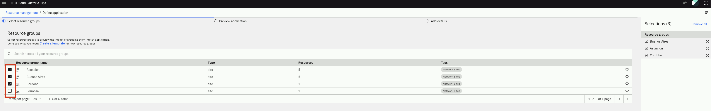
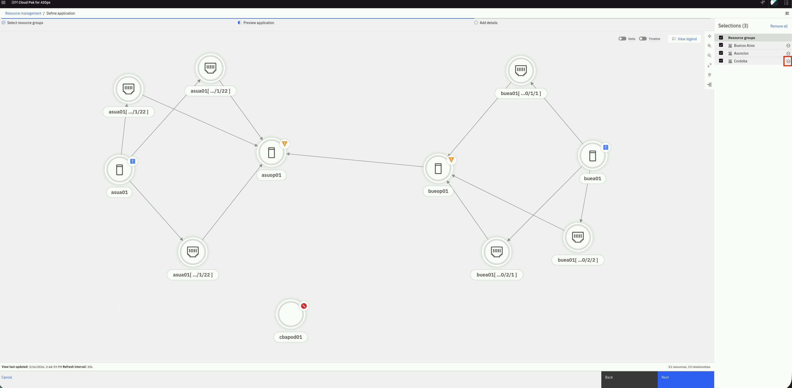
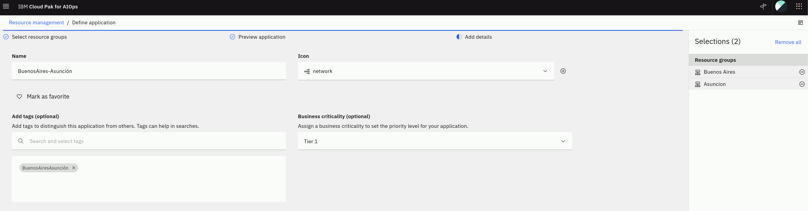
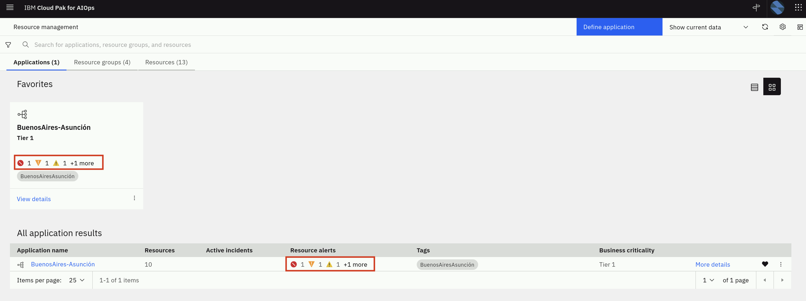
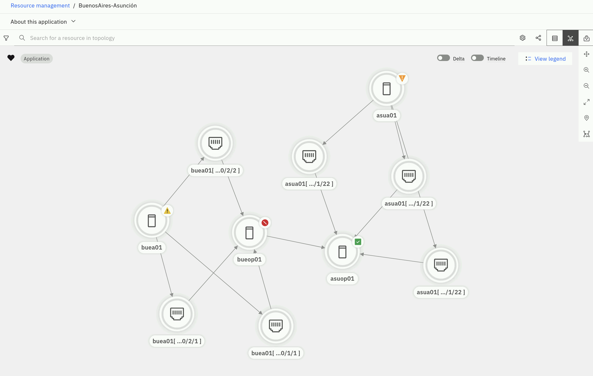
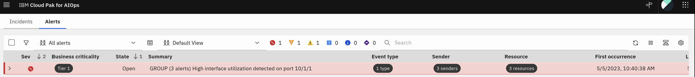
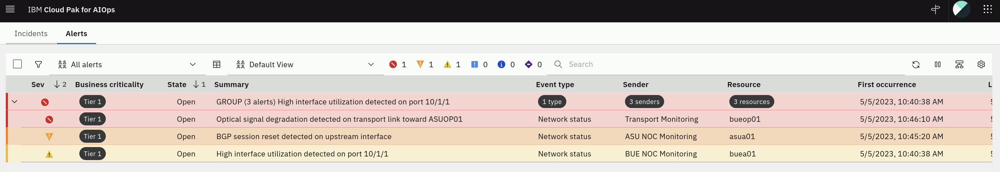

## 6.1: Business Criticality

The business criticality of a resource provides an indication of how critical to
the business that resource is, and therefore how important any related problems
might be. You can define the levels of business criticality for your
applications, resource groups and resources, and then view a list of them on the
Business criticality page.

Lets have a quick overview of Policies as they leverage Business Criticality.
Policies are rules that contain multiple condition and action sets. They can be
triggered to reduce noise by suppressing alerts, grouping alerts together,
automatically promote alerts to incidents, assign runbooks to remediate alerts,
etc.

:::note The topic of **Policies** is outside the scope of this Lab, but
additional information can be found in the product
[**documentation**](https://www.ibm.com/docs/en/cloud-paks/cloud-pak-watson-aiops/4.1.0?topic=policies-creating).
:::

Business Criticality plays a major factor in making sure that Policies reflect
business priorities in terms of what applications affect business operations the
most. Policies can be defined in a way that considers Business criticality as a factor to trigger actions such as promoting alerts to incidents that Network Operations Center (NOC) personnel can see in the Incident View. This allows operators to prioritize issues that impact critical telecom services.

### Defining Business Criticality

Now we will define some business criticality values that can then be assigned to
an application later in the Lab.

- From the burger menu in the top-left, navigate to: **Operate → Resource
  management**.
- In the **Resource management** page, click on the **Settings** gear icon in
  the top-right and select **Topology configuration**.


- From the **Topology configuration** page, in the **Business criticality**
  card, select **Configure**.


The Business criticality page is displayed listing any existing criticality
definitions in a table format by name, description, and criticality value, in
sortable columns. For the purpose of the Lab, we will use the predefined
criticality values but note that you can custom define these values to better
represent your specific Telco environment.

Click on **Start with presets**, inspect the preset values and click on **Add**.


We have now defined three tiers of business criticality as shown below:


## 6.2: Applications or Services?

Based on customer feedback, starting in v4.1, the Cloud Pak for AIOps provides
the option to call a collection of topology groups an **Application** or a
**Service**. From a product functionality point of view, there is no difference
between these two terms. But depending on the customer industry, these two terms
represent two different abstractions. In the Telecommunications industry, a
_Service_ represents a group of interconnected components such as routers,
switches, firewalls, etc. that participate in the operation of voice and data
communications. In mostly every other industry, an _Application_ represents a
set of IT resources that performs a specific function directly for an end user
or, in some cases, for another Application. In this Lab, we will use the term **Service**, as this aligns better with telecommunications environments where services represent connectivity delivered across multiple network components.


### Defining Applications/Services

You define and edit applications/services by adding (or removing) resource groups, icons
and tags, assigning business criticality levels, and setting service disruption
costs.

Lets define a fictional network service based on the existing topology resource groups:

- From the burger menu in the top-left, navigate to: **Operate → Resource
  management**.
- In the **Resource management** page, click the **Define application** button
  in the top-right.
- In the **Define application** page, we will select a subset of the resource
  groups defined in previous chapters using Topology Group Templates. These are
  the resource groups that belong to our fictional service. Lets select
  Buenos Aires, Asunción and Córdoba as shown
  below:



- Click **Next** to preview the application/service.

As we preview the application/service, we can use the checkbox to deselect resource
groups on the right sidebar in order to visualize the application/service without those
groups.

- In this preview step, we realize that we don't need the Córdoba
  resource group, so click on the (-) minus sign to remove the Córdoba
  resource group from this application/service.



- You should be left with the topology preview as shown below:


- Click **Next** to add additional details.
- Enter a **Name** for the service, for example **Buenos Aires - Asunción**
- Set an **Icon** for the application/service, using the drop-down list. This icon is used to identify the service resource type
  in the topology view of your services.
- Mark the service as a **favorite** by clicking on the heart icon.
- In the **Add tags** field, type **BuenosAiresAsunción** and select **Create new
  tag**. Tags can be used to identify similar services and to distinguish
  services from other services.
- In the **Business criticality** field, select **Tier 1**.

You should see the application details as shown below:



- Click **Define application**.

Now the application is added to the list of all applications on the page, as
shown below. Note that from this view we can see total number of resources, the
active Incidents and Alerts related to the application.


## 6.3: Alert Topological Correlation

We will see how the topology resource groups we have created are used to
correlate alerts. Topological alert grouping helps you understand when alerts
are connected based on their topology, providing valuable context information
for why related alerts might occur together.

In order to load alerts, we need to create a webhook connection and an event
loader script.

### Creating a Webhook Connection

The webhook connection allows the Cloud Pak for AIOps to expose an API that can
be used to load Ops events created by observability tools such as Datadog,
Zabbix and others:

- from the burger menu in the top-left navigate to: **Define → Integrations**
- from the **Integrations** page click on **Add integration**
- from the **Add integrations** page search for **webhook**, click on the
  **Generic Webhook** tile and click **Get started**.

Fill the **Add integration** form with these values:

- Name: eventWebhook
- Description: custom webhook connection for events
- Authentication type: _select Username/Password_
- Username: pick a username (e.g. test)
- Password: pick a password (e.g. test)

Your complete form should look like this (note that your route will be
different)


Click **Next**.

In the **Configure event mapping** form:

- Confirm the **Enable webhook** slider is green (On)
- The webhook connector leverages JSONata which is a simple expression language
  to transform JSON data. You can read about JSONata
  [here](https://jsonata.org/). In this Lab, we provide the JSON event format as
  expected by the Cloud Pak for AIOPs, therefore the JSONata is just a
  "passthrough". In a real scenario, you will find this mapping capability very
  useful.

Enter the following JSONata configuration (use the copy helper icon (top-right)
for one-click copy)

```json
{
   "sender":{
      "service": sender.service,
      "name": sender.name,
      "type": sender.type
   },
   "resource":{
      "application": resource.application,
      "name": resource.name,
      "hostname": resource.hostname,
      "type": resource.type,
      "ipaddress": resource.ipaddress,
      "location": resource.location
   },
   "type":{
      "classification": type.classification,
      "eventType": type.eventType
   },
   "severity": severity,
   "summary": summary,
   "occurrenceTime": occurrenceTime,
   "expirySeconds": expirySeconds
}
```

Click on **Done**. You will see a new webhook created as shown below. After the
webhook has finished initializing copy the **Webhook route** URL on the right.
You will need this URL in the next step.


### Creating a Webhook Event Loader Script

We will create a simple bash script that reads an event file and calls the
webhook API with every event in the file as a parameter.

In the same _lab_ folder, create a file called **event-load-webhook.sh** by
running the following command in the **Terminal** window to open the text editor
, **copy** the bash script below (use the copy helper icon (top-right) for
one-click copy), **paste** it into the text editor.

```
gedit event-load-webhook.sh
```

```sh
#!/bin/bash
# this is the event-load-webhook.sh script

# Check if a file is provided as a parameter
if [ $# -eq 0 ]; then
  echo "Please provide an event file as a parameter."
  exit 1
fi

###########################################
WEBHOOK_URL='<insert the webhook URL here>'
# Note below there is a colon character ':' between the username and password e.g. test:test
AUTH=<insert your chosen user name>:<insert your chosen password>
###########################################


# Read the event file line by line and submit the event via webhook
while IFS= read -r line; do
  curl -X POST -u $AUTH --insecure -H 'Content-Type: application/json' $WEBHOOK_URL -d "$line"
  echo ""
done < "$1"
```

There are two changes you need to make to the script:

- assign to WEBHOOK_URL the webhook route of the webhook you just created in the
  previous step
- assign to AUTH the chosen user name and password of the webhook you just
  created in the previous step e.g. test:test

Click on the **Save** button in the text editor and **close** the editor window
(click on the X).

### Validating Topological Correlation

We will now load a set of sample events. Because these events impact network elements that participate in the Buenos Aires – Asunción transport service (such as the BUEA01 and ASUA01 routers and the optical transport nodes), Cloud Pak for AIOps will correlate these alerts using topology relationships.

Create a new file called _topology-events.json_ by running the following command
in the **Terminal** window to open the text editor, **copy** the event data
below, **paste** it into the text editor, click on the **Save** button in the
text editor and **close** the editor window (click on the X).

```
gedit topology-events.json
```

```
{"sender":{"service":"Network Monitoring","name":"BUE NOC Monitoring","type":"Zabbix"},"resource":{"application":"Buenos Aires","name":"buea01","hostname":"buea01.telco.net","type":"router","ipaddress":"10.10.1.1","location":"Buenos Aires"},"type":{"classification":"Network status","eventType":"problem"},"severity":4,"summary":"High interface utilization detected on port 10/1/1","occurrenceTime":"2023-05-05T14:40:38.000Z","expirySeconds":0}
{"sender":{"service":"Network Monitoring","name":"ASU NOC Monitoring","type":"Zabbix"},"resource":{"application":"Asunción","name":"asua01","hostname":"asua01.telco.net","type":"router","ipaddress":"10.10.2.1","location":"Asuncion"},"type":{"classification":"Network status","eventType":"problem"},"severity":5,"summary":"BGP session reset detected on upstream interface","occurrenceTime":"2023-05-05T14:45:20.000Z","expirySeconds":0}
{"sender":{"service":"Optical Network Monitoring","name":"Transport Monitoring","type":"Telemetry"},"resource":{"application":"Buenos Aires","name":"bueop01","hostname":"bueop01.telco.net","type":"optical-node","ipaddress":"10.10.3.1","location":"Buenos Aires"},"type":{"classification":"Network status","eventType":"problem"},"severity":6,"summary":"Optical signal degradation detected on transport link toward ASUOP01","occurrenceTime":"2023-05-05T14:46:10.000Z","expirySeconds":0}
```

Now lets submit the events via the _webhook event loader script_ created in the
previous section by running the following command from the **Terminal** window:

```
bash event-load-webhook.sh topology-events.json
```

First, lets see how the Application/Service we have defined shows these events:

- From the burger menu in the top-left navigate to: **Operate → Resource
  Management** and click on the **Applications** tab

Note that the events impacting the resources, have rolled-up into the impacted
**Application** that contains these resources, as shown below



Click on the Service name (**Buenos Aires - Asuncion Transport Service**) to see the topology
resources impacted



Finally, lets see how these events are correlated:

- From the burger menu in the top-left navigate to: **Operate → Alerts** 
- Click on the **Refresh alerts** icon on the right
- Lets add some color to this page:
  - Click on the **gear** icon in the right and select **User preferences**.
  - From the **User preferences for alerts** pop-up, click on the **Row
    coloring** switch to On (green).
  - Click on **Save**.

In the Alerts view, we can see a single group of alerts as shown below.



Click on the chevron icon on the left to expand this group. See how the three
events we have submitted have been grouped together. Also click on the **View
correlation** icon in the top-right, the Correlation column on the right, shows
the topological group icon.



## 6.4: Lab Recap

Congratulations if you made it here!. We have seen a lot of features in a short
period of time. If there is a single thought that you can take away from this
Lab, this is it:

_A real-time, unified Topology View is a core capability of the Cloud Pak for
AIOps, as it allows to visualize topology changes over time, anomalous alerts in
context and the correlation of alerts based on the impacted topology resources.
Topology is a key component to achieve fast incident resolution through the
Cloud Pak for AIOps._
